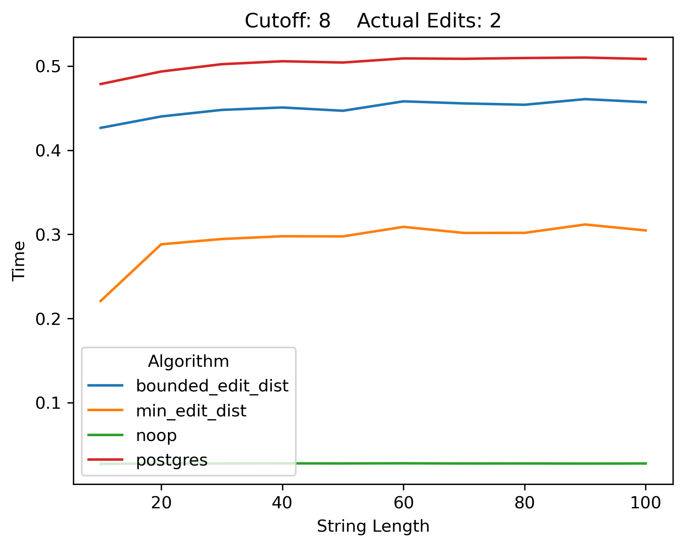
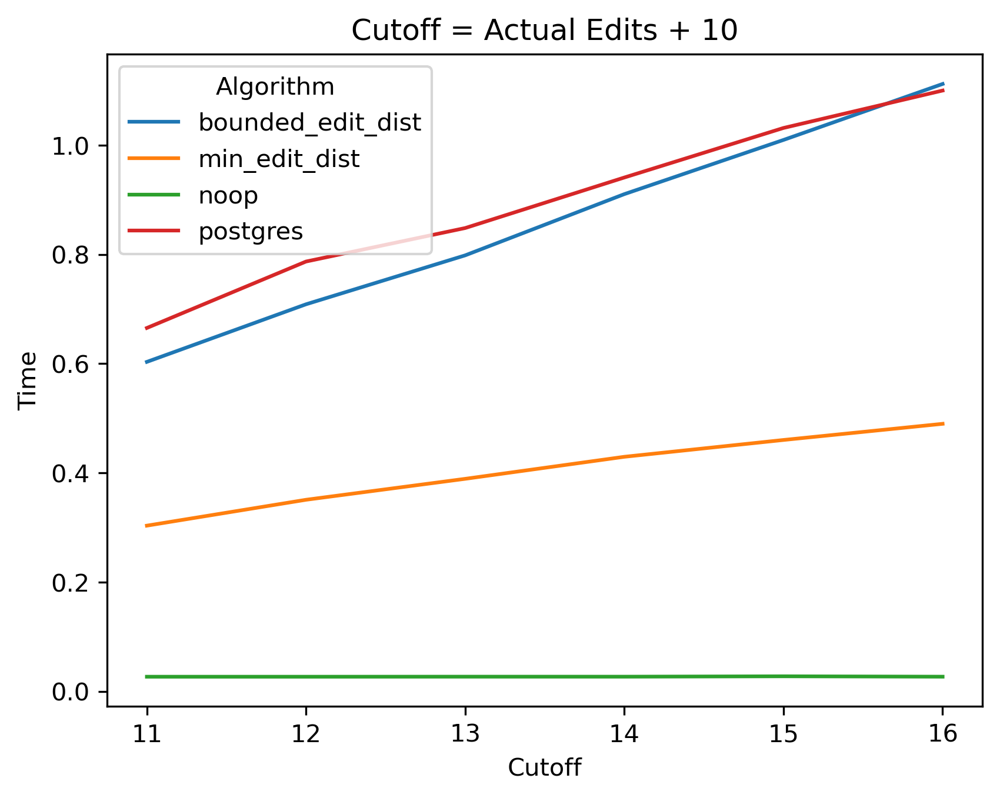

# Blazingly Fast Damerau–Levenshtein Edit Distance UDF for MySQL

An extremely fast and efficient implementation of Levenshtein edit distance and Damerau–Levenshtein edit distance for
MySQL / MariaDB. This UDF is implemented in C++.

The _edit distance_ between two strings is defined as the minimum number of edits required to transform one string into
the other. The difference between _Levenshstein_ edit distance and _Damerau–Levenshtein_ edit distance is in what counts
as an "edit": Damerau–Levenshtein includes the transposition of two characters.

|                                      | Levenshstein | Damerau–Levenshtein |
|:-------------------------------------|:------------:|:-------------------:|
| insert a character                   |      X       |          X          |
| delete a character                   |      X       |          X          |
| substitute one character for another |      X       |          X          |
| swap two adjacent characters         |    &nbsp;    |          X          |

The most interesting feature of this library is a variant optimized for finding the closest match to a particular string among a list of strings: `min_edit_dist`. Compare its performance to PostgreSQL's implementation.

|  |  |
| ------------------------------------------------------------ | ------------------------------------------------------------ |
| `min_edit_dist` performs much faster searching for closest match. | `min_edit_dist`'s benefit increases when cutoff grows larger than  number of edits. |

## Catalog of Functions

This UDF provides several different functions for different use cases.

| Function                                        | Description                                                  |
| :---------------------------------------------- | :----------------------------------------------------------- |
| `edit_dist(string1, string2)`                   | Computes the edit distance between two strings.  (Levenshtein edit distance, no transpositions) |
| `edit_dist_t(string1, string2)`                 | Computes the edit distance between two strings, allowing transpositions.  (Damerau-Levenshtein edit distance) |
| `bounded_edit_dist(string1, string2, cutoff)`   | Computes the edit distance between two strings if the distance is at most `cutoff`; otherwise returns `cutoff + 1`.  (Levenshtein edit distance, no transpositions) |
| `bounded_edit_dist_t(string1, string2, cutoff)` | Computes the edit distance between two strings if the distance is at most `cutoff`; otherwise returns `cutoff + 1`.  (Damerau-Levenshtein edit distance) |
| `min_edit_dist(string1, string2, cutoff)`       | Remembers the smallest edit distance seen so far during the query and uses it as a cutoff during the computation. |
| `min_edit_dist_t(string1, string2, cutoff)`     | Same as `min_edit_dist` but allows transpositions.           |
| `similarity_t(string1, string2, cutoff)`        | Computes a _normalized_ Damerau-Levenshtein percent **_similarity_** between two strings. |
| `min_similarity_t(string1, string2, cutoff)`    | Same as `similarity_t`, but remembers the smallest edit distance seen so far during the query and uses it as a cutoff during the computation. |

- The suffix `_t` stands for *transpositions* and indicates the function counts swapping two adjacent characters as an edit (Damerau-Levenshtein edit distance).
- The prefix `bounded_` allows the algorithm to stop computing if it can prove the cutoff will be exceeded. This provides a *significant* performance improvement over the unbounded version, especially if you can give it a very small `cutoff`.
- The `min_`  functions remember the smallest edit distance seen so far in the search and use it as the upper bound as in the `bounded_` functions. Use this for searching for the closest match to a single particular string, as it will give you much better performance for this use case.  Because of how this algorithm works, the "distance" computed is only guaranteed to be accurate if it is the *smallest* distance computed during the query. 

- The `min_` functions only come in the bounded variety. If you want unbounded, set the bound to a very high number.
- Similarity is a number from 0.0 to 1.0 interpreted as a percent similarity. Its advantage is that it is independent of string length. Similarity is computed by *normalizing* the edit distance by dividing it by the length of the longest string and subtracting that number from 100%: $100\% - \frac{\text{edit distance}}{\text{max}(\;\text{length}(\text{string1}),\; \text{length}(\text{string2})\;)}$
- There is no plain `similarity`, only `similarity_t`. If you want a similarity without transpositions, you can either compute it yourself using `edit_dist` and the formula for similarity, or you can request we add it.

## Limitations

* This implementation assumes characters are represented as 8 bit `char`'s on your platform. If you are using UTF-8 codepoints above 255 (i.e. outside of UCS-2), this function will not
  compute the correct edit distance between your strings.
* This function is case sensitive. If you need case insensitivity, you need to either compose this
  function with `LOWER`/`TOLOWER`, or adapt the code.
* By default, `BUFFER_SIZE` has a default maximum of 4096 bytes. You can configure this maximum by changing
  `BUFFER_SIZE` in `CMakeLists.txt`. See the Configuration section below for more details.

Any one of these limitations would be a good for a contributor to solve. Make a pull
request!

## Building, Installation, Detailed Documentation, Benchmarks, Testing, Contributing

|                                                              |                                                              |
| :----------------------------------------------------------- | :----------------------------------------------------------- |
| [Detailed Function Usage](doc/Usage.md)                      | Detailed documentation for each function with examples       |
| [Common Optimizations For Computing Levenshtein Edit Distance](doc/OptimizingEditDistance) | An article describing a variety of optimizations used in this and other libraries |
| [Building and Installing](doc/Building.md)                   | How to compile and install the library on your system        |
| [Testing and Benchmarking](doc/Testing)                      | How to use the testing and benchmarking tools                |
| [Some benchmark results](doc/Benchmarks.md)                  | A comparison between the different functions in this library and to a couple of other libraries |
| [Contributing](doc/Contributing.md)                          | Some notes for anyone wishing to contribute to this library  |
| [Notes](doc/Notes.md)                                        | Developer notes - a dumping ground for To-Do's and bits of information that doesn't belong anywhere else |
| [License](License.txt)                                       | The MIT license                                              |

## Invitation For Peer Review

I have tested this library extensively, but a single person is susceptible to making the same mistake over and over again. There is no substitute for quality peer review. I invite other people to test and critique this library and report back to me. 

## Authors and License

Copyright (C) 2019-2024 Robert Jacobson. Released under the MIT license.

The MIT License

Permission is hereby granted, free of charge, to any person obtaining a copy
of this software and associated documentation files (the "Software"), to
deal in the Software without restriction, including without limitation the
rights to use, copy, modify, merge, publish, distribute, sublicense, and/or
sell copies of the Software, and to permit persons to whom the Software is
furnished to do so, subject to the following conditions:

The above copyright notice and this permission notice shall be included in
all copies or substantial portions of the Software.

THE SOFTWARE IS PROVIDED "AS IS", WITHOUT WARRANTY OF ANY KIND, EXPRESS OR
IMPLIED, INCLUDING BUT NOT LIMITED TO THE WARRANTIES OF MERCHANTABILITY,
FITNESS FOR A PARTICULAR PURPOSE AND NONINFRINGEMENT. IN NO EVENT SHALL THE
AUTHORS OR COPYRIGHT HOLDERS BE LIABLE FOR ANY CLAIM, DAMAGES OR OTHER
LIABILITY, WHETHER IN AN ACTION OF CONTRACT, TORT OR OTHERWISE, ARISING
FROM, OUT OF OR IN CONNECTION WITH THE SOFTWARE OR THE USE OR OTHER DEALINGS
IN THE SOFTWARE.
