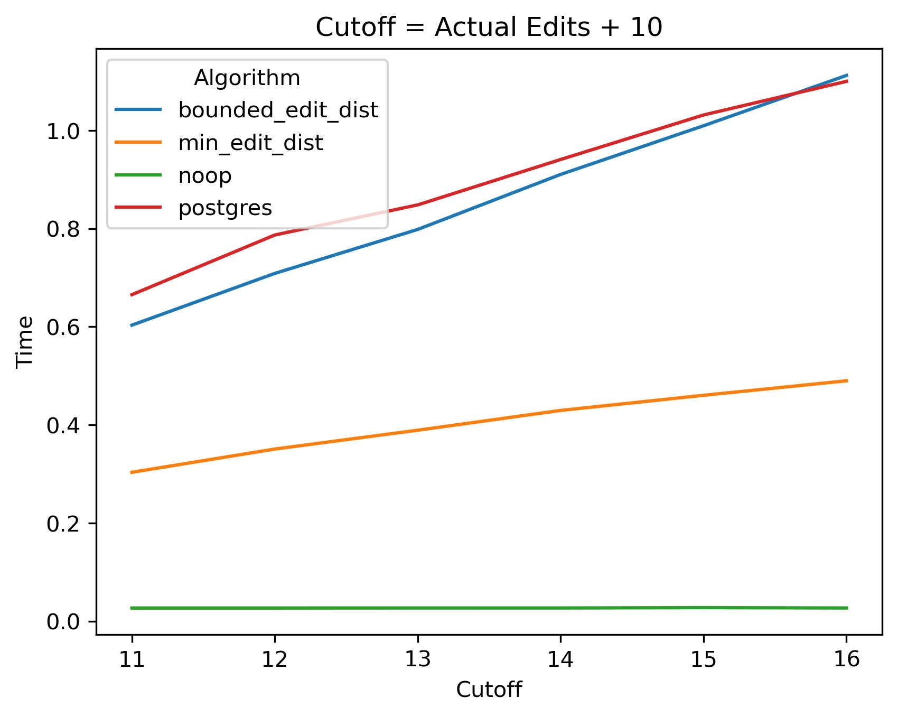

# Benchmarks

For purposes of comparison, in addition to the algorithms of this library, we include an "algorithm" called `noop`, which immediately returns without doing anything, and `postgres`. The implementation of Levenshtein edit distance in PostgreSQL is known for being very fast and efficient. It uses a two row banded algorithm (see [Optimizing Edit Distance](OptimizingEditDistance.md)). The `postgres` algorithm is the code from PostgreSQL's implementation that has been modifed in a few ways:

- It has been modified to fit the test harness.
- Support for UTF-8 (variable byte length character encoding) has been removed. Thus, only it's "fast path" is being tested.
- Instead of allocating memory on each call (from PostgreSQL's internal allocator), it has been modified to reuse a pre-allocated buffer.

The last two modifications in particular can dramatically affect running time. Moreover, the algorithms might perform slightly differently on different platforms. 

## Synthetic Data

We generate 2 million strings of length `n` (the "haystack"), randomly select 2,000 of the strings and generate the list of strings to search for ("needles") by applying `e` edits to each. Notice that the needle is nearly the same length as the strings in the haystack, its length differing only due to unbalanced insertions and deletions. For simplicity, we will assume they are the same length in our analysis. This experiment is repeated for all combinations of cuttoff and number of edits `e` between 2 and 16 inclusive, for strong length `n` from 10 to 250, step by 10.

### Standard vs. Banded (Limited Distance)

The regular (non banded) algorithm `edit_dist` runs in $O(n^2)$ time, where $n$ is the length of the strings. The running time of the regular algorithm very quickly overwhelms all other algorithms. The cutoff parameter only applies to the banded variants (including `postgres`), and the running time of `edit_dist` is unaffected by number of actual edits `e`.

We therefore remove `edit_dist` in the remaining plots.

### Advantage of `min_edit_dist` Over `bounded_edit_dist`

The `min_edit_dist` algorithm remembers the smallest edit distance observed so far as it searches the list. Thus, it gives the greatest benefit when it is able to find a very small edit distance. The location of the unedited version of the search string is in a random place within the list, so the expected value of its location is halfway through the search. If it finds an edit distance of 0, it can search the remainder of the list almost as fast as `noop`, which is a negligable amount of time relative to the other running times. Therefore, the running time of `min_edit_dist` approaches 50% of `bounded_edit_dist` as it's advantage approaches optimal (an edit distance of 0 in the list).

The shape of this graph (cutoff=16, edits=10) is typical. It is virtually identical to that of (cutoff=6, edits=2), for example, except for the time scale.

Observe that for small strings (< ~250 characters) the running time of the algorithms is virtually constant.

## Real-world Data

The real-world data set is a list of 2 million scientific names of species and subspecies from the online [GBIF](https://www.gbif.org/) database. These names are found in a variety of sources with human-introduced errors and errors from Optical Character Recognition, for example, in CITES documents that accompany international shipments of wildlife. Strings were not sorted by string length, so we look at the effect of varying the cutoff. As the cutoff increases, running time approaches that of the non banded algorithm `edit_dist`.

The algorithms in this library perform the best relative to `postgres` when the cutoff is high and the actual number of edits is low.

The algorithms converge in the worst case.

Typically you will want the cutoff to be as low as possible without excluding the actual number of edits. The optimal case is when cutoff = actual edits.

